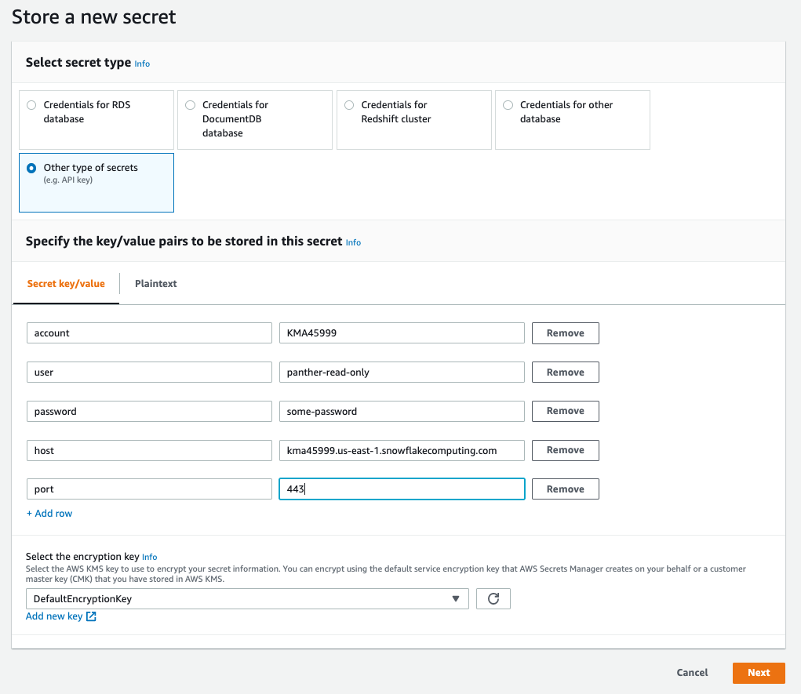

# [Snowflake](https://www.snowflake.com) Database Integration

Panther can be configured to write processed log data to one or more AWS-based Snowflake database clusters. 
This allows you to join Panther processed data with your other data sources in Snowflake.

Integrating Panther with Snowflake enables Panther data to be used in your Business Intelligence tools to make dashboards tailored to you operations. 
In addition, you can join Panther data (e.g., Panther alerts) to your business data, enabling assessment of your security posture with respect to your organization.

For example, you can tally alerts by organizational division (e.g., Human Resources) or by infrastructure (e.g., Development, Test, Production).

Panther uses [Snowpipe](https://docs.snowflake.com/en/user-guide/data-load-snowpipe-intro.html) to copy the data into your Snowflake cluster.

## Configuration Overview

There are two parts to configuring Panther to integrate with Snowflake.

Part 1: Configure the Panther user interface with an AWS Secret for access

Part 2: Configure Panther to ingest data into Snowflake

Part 3: Test Panther user interface with Snowflake

## Configure the Panther User Interface with an AWS Secret for access

Create a [user](https://docs.snowflake.com/en/sql-reference/sql/create-user.html) associated with a 
[read-only role](https://docs.snowflake.com/en/user-guide/security-access-control-configure.html#creating-read-only-roles) 
in your Snowflake account with grants to read tables from the following databases:
* `panther_logs`
* `panther_rule_matches`
* `panther_views`

You may want to allow more tables so that you can join data to the Panther data from the Panther [Data Explorer](./data-analytics/data-explorer.md).

Create a secret in the [AWS Secrets Manager](https://aws.amazon.com/secrets-manager/). Ideally this should be created
in the same AWS region as the Panther deployment but this is optional. This secret will be used
by Panther to read database tables. It will be configured to only allow access from a single lambda function
in the Panther account.

First, access the AWS Secrets Manager via the console and select `Store a New Secret` button on the page.

Second, you will be presented with a page titled `Store a new secret`. Select `Other type of secrets` from the
list of types. Specify the following key/value pairs:
* account (NOTE: this can be found by clicking on the snowflake console on your login name)
* user
* password
* host (NOTE: this is usually: <account>.<region>.snowflakecomputing.com)
* port (NOTE: use 443 unless you have configured differently)

Then click `Next`.



You will be presented with a screen asking for the name and description of the secret. Fill these in and click `Next`.


The next screen concerns autorotation, just click the `Next` button.


Finally you will be presented with an overview screen. Scroll to the bottom and click the `Store` button.

If using a pre-packaged deployment then update the `SecretsManagerARN` attribute with the ARN of the secret in 
the CloudFormation template inputs or in the `panther_config.yml` file if deploying from source.

## Configure Data Ingest into Snowflake

In order to configure Panther, you need to get the `SNOWFLAKE_IAM_USER` from Snowflake.

In a Snowflake SQL shell execute the below sql, replacing `myaccountid` with your AWS account ID and `myaccountregion` with the account's region:

```sql
SELECT system$get_aws_sns_iam_policy('arn:aws:sns:myaccountregion:myaccountid:panther-processed-data-notifications');
```

You should see a response of:

```json
{
 "Version":"2012-10-17",
 "Statement":[
  {
    "Sid":"1",
    "Effect":"Allow",
    "Principal":{
       "AWS":"arn:aws:iam::34318291XXXX:user/k7m2-s-v2st0722"
    },
    "Action":["sns:Subscribe"],
    "Resource":["arn:aws:sns:myaccountregion:myaccoundid:panther-processed-data-notifications"]
  }
 ]
}
```

In the above example, the `SNOWFLAKE_IAM_USER` is the `AWS` attribute `arn:aws:iam::34318291XXXX:user/k7m2-s-v2st0722`.

Edit your `deployments/panther_config.yml` to add `arn:aws:iam::34318291XXXX:user/k7m2-s-v2st0722` the to Snowflake configuration:

```yaml
 # Snowflake (https://www.snowflake.com/) Integration
  Snowflake:
    # List of Snowflake cluster IAM ARNs which will ingest the output of Panther log processing.
    # If this list is non-empty, a file will be produced by `mage snowflake:snowpipe`
    # called './out/snowflake/showpipe.sql' that should be run in your snowflake cluster
    # to configure Snowpipe and declare the Panther tables.
    # For example:
    # DestinationClusterARNs:
    #  - arn:aws:iam::34318291XXXX:user/k8m1-s-v2st0721 # test snowflake cluster
    #  - arn:aws:iam::34318291XXXX:user/h1h4-s-a2st0111 # production snowflake cluster
    DestinationClusterARNs:
      - arn:aws:iam::34318291XXXX:user/k7m2-s-v2st0722
```

If deploying using a pre-packaged deployment also update `DestinationClusterARNs` as above in the CloudFormation inputs.

Next, run `mage deploy` if deploying from source or deploy via the pre-packaged deployment using CloudFormation.

When the deployment is done, run `mage snowflake:snowpipe`. When finished there should be a `snowpipe.sql` file 
created in `./out/snowflake/snowpipe.sql`

In the Snowflake SQL shell use the `Load Script` option to load `snowpipe.sql`


Select the `All Queries` checkbox, then click on `Run`


## Validation
Once `snowpipe.sql` has been successfully executed, you should have three databases:
* `panther_logs`
* `panther_rule_matches`
* `panther_views`

These are the same database names used in AWS Athena and queries should behave similarly.

Assuming you have data being regularly being processed, there should be data in the tables in a few minutes.

You can quickly test if the data ingestion is working by running simple queries, for example:

```sql
SELECT count(1) AS c FROM panther_logs.public.aws_cloudtrail ;
```

 
## Test Panther user interface with Snowflake

We need to configure the permissions for the Panther AWS secret. Go to the console and select the secret you created
above. On the overview screen click on the `Edit Permissions` button.
Copy the below policy JSON, substituting the `<snowflake api lambda role>` at the top of the 
generated `./out/snowflake/snowpipe.sql` file from above, and `<secret ARN>` for the ARN of the secret just created.
```json
{
    "Version": "2012-10-17",
    "Statement": [
        {
            "Effect": "Allow",
            "Principal": {"AWS": "<snowflake api lambda role>" },
            "Action": "secretsmanager:GetSecretValue",
            "Resource": "<secret ARN>"
        }
    ]
}
```
Then click the `Save` button.

The configuration can be tested from the [Data Explorer](./data-analytics/data-explorer.md). Run some same queries over a
table that you know has data (check via Snowflake console).

To rotate secrets, create a NEW read-only user and edit the secret replacing the old
user and password with the new user and password. Wait one hour before deleting/disabling the the old user in Snowflake. 
 
 